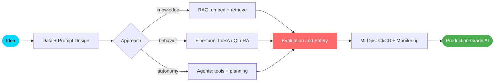

<!-- ===================== HERO ===================== -->
<a href="#">
  
</a>

<div align="center">


<br/>

<a href="https://www.linkedin.com/in/sauravdnj"></a>&nbsp;
<a href="https://github.com/SauravDnj"></a>&nbsp;
<a href="https://instagram.com/saurav_dnj_24"></a>&nbsp;
<a href="#"></a>

</div>

<!-- ===================== INTRO ===================== -->


```python
class SauravDanej:
    def __init__(self):
        self.role      = "AI / Machine Learning Engineer"
        self.focus     = ["LLMs", "RAG", "Autonomous Agents", "MLOps"]
        self.stack     = ["Python", "PyTorch", "LangChain", "FastAPI", "Next.js"]
        self.mindset   = "research -> prototype -> production"

    def what_i_do(self) -> str:
        return "Turn cutting-edge AI into reliable, real-world products."
```

<!-- ===================== RIGHT GIF + HIGHLIGHTS ===================== -->


### ⚡ Quick Highlights

- 🧠 I architect **LLM apps, RAG pipelines, and multi-agent systems** — end to end.
- 🛠️ Full-stack engineer: **Python ML** · **React / Next.js** · **FastAPI / Node.js**.
- 🚀 I ship to production with **MLOps** — versioning, monitoring, scaling.
- 🌱 Currently deep into **agentic workflows** and **LLM fine-tuning**.
- 💬 Ask me about **prompt engineering, vector search, and model deployment**.

<br clear="right"/>

<!-- ===================== TECH STACK ===================== -->
## 🧰 &nbsp;Tech Stack

<table>
<tr>
<td valign="top" width="50%">

**🤖 AI / ML**


**🗄️ Data &amp; Vector**


</td>
<td valign="top" width="50%">

**💻 Full Stack**


**☁️ DevOps &amp; Cloud**


</td>
</tr>
</table>

<!-- ===================== FOCUS AREAS ===================== -->
## 🎯 &nbsp;What I Specialize In

<div align="center">

| 🤖 Large Language Models | 🔍 Retrieval-Augmented Generation | 🧩 AI Agents |
| :---: | :---: | :---: |
| Prompt engineering | Vector databases | Tool calling |
| Fine-tuning (LoRA / QLoRA) | Hybrid &amp; semantic search | Planning &amp; reasoning |
| Evaluation &amp; safety | Chunking &amp; re-ranking | Multi-agent orchestration |
| **GPT · Claude · LLaMA** | **Pinecone · Chroma · FAISS** | **LangGraph · CrewAI** |

| 📝 NLP | 👁️ Computer Vision | 🔬 MLOps |
| :---: | :---: | :---: |
| Classification &amp; NER | Object detection (YOLO) | CI/CD for ML |
| Summarization &amp; QA | Image segmentation | Model monitoring |
| Sentiment analysis | Image generation (Diffusion) | Docker / K8s deploy |
| Machine translation | Face recognition | A/B testing |

</div>

<!-- ===================== PROJECTS ===================== -->
## 🚀 &nbsp;Featured Projects

<!-- 👉 Replace the placeholder names, links, and descriptions with your real repositories. -->

<table>
<tr>
<td width="50%" valign="top">

#### 🤖 [LLM App — _project name_](https://github.com/SauravDnj)
> One-line description of your LLM-powered application.

`Python` · `LangChain` · `FastAPI`

</td>
<td width="50%" valign="top">

#### 🔍 [RAG Pipeline — _project name_](https://github.com/SauravDnj)
> One-line description of your retrieval system.

`Python` · `Chroma` · `OpenAI`

</td>
</tr>
<tr>
<td width="50%" valign="top">

#### 🧩 [Agent System — _project name_](https://github.com/SauravDnj)
> One-line description of your multi-agent project.

`Python` · `CrewAI` · `React`

</td>
<td width="50%" valign="top">

#### 💻 [Web App — _project name_](https://github.com/SauravDnj)
> One-line description of your full-stack app.

`Next.js` · `Node.js` · `PostgreSQL`

</td>
</tr>
</table>

<!-- ===================== STATS ===================== -->
## 📊 &nbsp;GitHub Stats

<div align="center">


</div>

<!-- ===================== CONTRIBUTION SNAKE ===================== -->
<div align="center">


</div>

<!-- ===================== TROPHIES ===================== -->
<div align="center">


</div>

<!-- ===================== ARCHITECTURE MAP ===================== -->
## 🧭 &nbsp;How I Build AI Systems



<!-- ===================== QUOTE + FOOTER ===================== -->
<div align="center">

<br/>


### ✨ _"Research is curiosity. Engineering is making it useful."_


</div>
